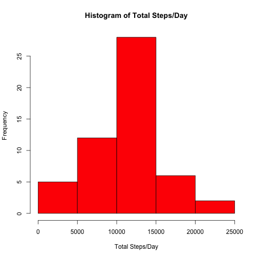
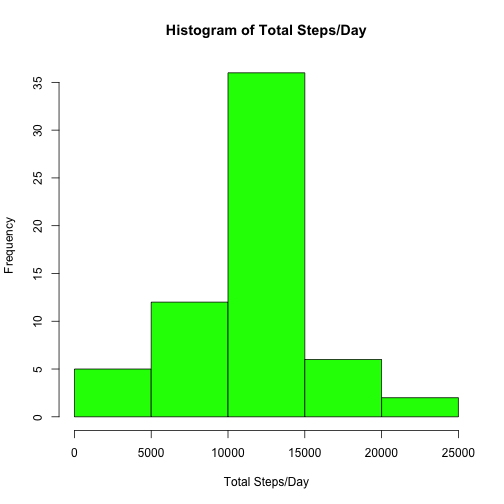
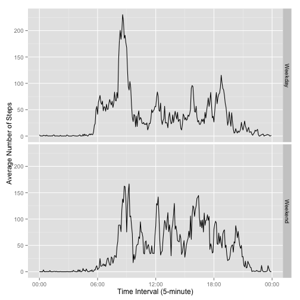

## Introduction

It is now possible to collect a large amount of data about personal
movement using activity monitoring devices such as a
[Fitbit](http://www.fitbit.com), [Nike
Fuelband](http://www.nike.com/us/en_us/c/nikeplus-fuelband), or
[Jawbone Up](https://jawbone.com/up). These type of devices are part of
the "quantified self" movement -- a group of enthusiasts who take
measurements about themselves regularly to improve their health, to
find patterns in their behavior, or because they are tech geeks. But
these data remain under-utilized both because the raw data are hard to
obtain and there is a lack of statistical methods and software for
processing and interpreting the data.

This assignment makes use of data from a personal activity monitoring
device. This device collects data at 5 minute intervals through out the
day. The data consists of two months of data from an anonymous
individual collected during the months of October and November, 2012
and include the number of steps taken in 5 minute intervals each day.

## Loading and preprocessing the data

First, we unzip and load the data into a data frame. Second, we format the date and interval column to date and datetime types.


```r
# load the data
unzip("activity.zip")
df <- read.csv("activity.csv", header=TRUE, colClass=c("numeric", "character", "numeric"), sep=",")

# format the columns
df$date <- as.Date(df$date, "%Y-%m-%d")
df$interval<-as.POSIXct(paste0(as.character(df$date), " " , as.character(df$interval %/% 100), ":", as.character(df$interval %% 100), ":00"))
```

## What is mean total number of steps taken per day?

In order to calulate the mean, we get the sum of number of steps for each day. 


```r
# sum of steps per day
sumdaily <- aggregate(steps ~ date, data=df, sum, na.rm=TRUE)
```

The histogram below shows the distribution of total number of steps taken per day.


```r
hist(sumdaily$steps, col="red", main="Histogram of Total Steps/Day", xlab="Total Steps/Day", ylab="Frequency")
```

 

Now we compute the mean and median total number of steps per day.


```r
# calculate the mean and medeian total number of steps taken per day
meandaily <- mean(sumdaily$steps)
mediandaily <- median(sumdaily$steps)
```

The value of mean is 1.0766189 &times; 10<sup>4</sup> and the value of median is 1.0765 &times; 10<sup>4</sup>.

## What is the average daily activity pattern?

We calculate the mean of steps taken for each interval across all the days.


```r
dailyintaves <- aggregate(steps ~ strftime(interval, format="%H:%M:%S"), data=df, mean, na.rm=TRUE)
colnames(dailyintaves) <- c('interval', 'steps')
```

The plot below illustrates the time series plot of the 5-minute interval and the average number of steps taken, averaged across all days.


```r
plot(as.POSIXct(dailyintaves$interval, format="%H:%M:%S"), dailyintaves$steps, type="l", xlab="Time Interval (5 minutes)", ylab="Average Number of Steps")
```

 

```r
# max of steps in interval
maxdailyintaves <- dailyintaves[which.max(dailyintaves$steps), 1]
```

08:35:00 is the 5-minute interval that this person has the maximum average number of steps across all days.

## Imputing missing values

The presence of missing days may introduce bias into some calculations or summaries of the data and we see many NA values in the dataset.


```r
# number of na values for steps column
navals <- sum(is.na(df$steps))
```

2304 is the number of rows which contains NA value for steps column. To impute these NA values, we fill them up with the mean for that 5-minute interval and save them in a new data frame.


```r
# the new data frame is a copy of the original data frame with imputing missing values
dfnona <- data.frame()
steps <- vector()
for (i in 1:nrow(df)) {
    if (is.na(df$steps[i]))
        steps <- c(steps, dailyintaves[which(dailyintaves$interval == strftime(df$interval[i], format="%H:%M:%S")),][1,2])
    else
        steps <- c(steps, df$steps[i])
}
dfnona <- data.frame(steps=steps, date=df$date, interval=df$interval)
```

Now, let's see how the distribution of total number of steps taken each day looks like with the data filled in and we calculate the mean and median again.


```r
# sum of steps per day
sumdailynona <- aggregate(steps ~ date, data=dfnona, sum, na.rm=TRUE)

hist(sumdailynona$steps, col="green", main="Histogram of Total Steps/Day", xlab="Total Steps/Day", ylab="Frequency")
```

 

```r
# calculate the mean and medeian total number of steps taken per day
meandailynona <- mean(sumdailynona$steps)
mediandailynona <- median(sumdailynona$steps)
```

The value of mean is 1.0766189 &times; 10<sup>4</sup> and the value of median is 1.0766189 &times; 10<sup>4</sup>. As we see, these values are not very different from the values with no filled-in data, therefore, there is no impact of imputing missing data. Basically, we added some mean values which do not have any effect on the mean and median values in the dataset.

## Are there differences in activity patterns between weekdays and weekends?

We would like to compare the activity pattern of this person during the weekdays and weekends separately. The plots below are the time series of 5-minute interval and the average number of steps taken across all weekdays and across the weekends.


```r
daytype <- c("Monday", "Tuesday", "Wednesday", "Thursday", "Friday")
dfnona<-transform(dfnona, daytype = ifelse(weekdays(dfnona$date) %in% daytype, "Weekday", "Weekend"))
dfnona$daytype <- factor(dfnona$daytype)

dailydtaves <- aggregate(steps ~ strftime(interval, format="%H:%M:%S") + daytype, data=dfnona, mean, na.rm=TRUE)
colnames(dailydtaves) <- c('interval', 'daytype', 'steps')

library(ggplot2)
library(scales)
ggplot(dailydtaves, aes(as.POSIXct(interval, format="%H:%M"), steps)) + facet_grid(daytype~.) + geom_line() + scale_x_datetime( labels=date_format("%H:%M")) + labs(x="Time Interval (5-minute)", y="Average Number of Steps")
```

 

During the weekdays there is a peak in the morning (close to 9:00 interval) for number of steps and during the weekends the number of steps seems to be more distributed and smoother.
